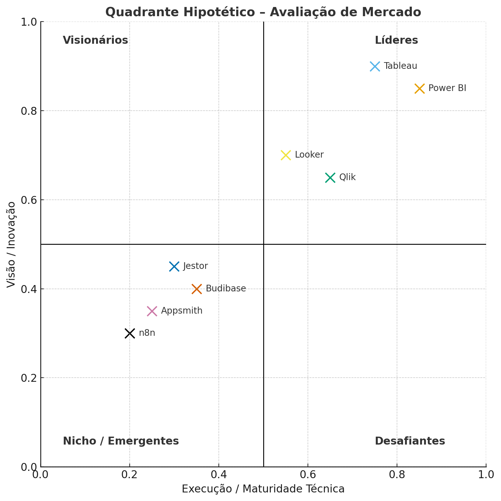

 

Case Contabilizei – EI DISCOVERY: Democratizando Dados com IA - <b>INFO-4-ALL FIAP 2025</b>

## 📌 Menu

1. [Declaração de Problema &  Mapa de Empatia](./MAPA_EMPATIA_DECLARACAO_DE_PROBLEMA.md)

1. [Objetivo da Solução](#1-objetivo-da-solução)

1. [Avaliação de Mercado](#2-avaliação-de-mercado)

1. [Atributos Técnicos e Funcionais](#3-atributos-técnicos-e-funcionais)

1. [Modelo de Licenciamento e Custo](#4-modelo-de-licenciamento-e-custo)
1. [Buy vs. Build](#5-buy-vs-build)

1. [Open Source vs. Proprietário](#6-open-source-vs-proprietário)

1. [Casos de Uso e Referências](#7-casos-de-uso-e-referências)

## 1. Objetivo da Solução

**Qual problema a plataforma deve resolver?**  
Hoje as áreas de negócio dependem do time técnico para consultar, cruzar e visualizar dados. Isso gera **lentidão e gargalos**.

**O que a plataforma deve resolver:**

- Dar **autonomia** para qualquer usuário consultar, visualizar e entender dados em português natural.
- Reduzir a dependência do time de TI e acelerar decisões.

**Categoria:**  
Não é só automação de processos, nem só criação de apps → é uma **plataforma de análise de dados com IA** (_self-service BI + NLP + explicações_).

- **Self-service BI** → o usuário monta relatórios e dashboards sozinho, tipo Power BI/Tableau, mas sem precisar dominar SQL.
- **NLP (Processamento de Linguagem Natural)** → em vez de query técnica, o usuário pergunta em português:  
  _“Qual foi o lucro por região no último trimestre?”_ → a IA traduz em SQL.
- **Explicações automáticas** → além do gráfico, a IA escreve insights:  
  _“O lucro caiu no Sul por aumento de custos logísticos em abril.”_

👉 **Resultado esperado:** democratização dos dados → qualquer pessoa acessa, entende e decide, sem travar o time técnico.

## 2. Avaliação de Mercado

### Posicionamento por Quadrante (Gartner / Forrester)

Com base nas versões mais recentes do **Gartner Magic Quadrant para Analytics & BI** e relatórios similares, podemos posicionar alguns dos players como:

- **Líderes**: Power BI (Microsoft) — reconhecido como líder por muitos anos consecutivos. 

- **Desafiantes / Visionários**: Qlik — mantido em posição de destaque no Quadrante para Analytics/BI. 

- **Nichos ou emergentes**: plataformas mais novas ou de nicho (por exemplo, Budibase, Appsmith, Jestor) — podem não aparecer em todos os relatórios de analistas, mas têm potencial de crescimento por foco em customização ou uso específico.

Um relatório recente “2025 Gartner Magic Quadrant for Analytics and BI Platforms” discute movimentações de mercado e tendências. 

### Presença e reputação em G2 / Capterra / reviews

- No **G2**, o Power BI aparece como destaque em “Best Analytics Platforms”.  
- Em rankings de BI e Analytics, ferramentas como Tableau e Power BI lideram em avaliação de usabilidade, presença de mercado e satisfação de usuários.
- Também em análises comparativas, o Looker é citado entre as melhores plataformas analíticas, por seu modelo de dados e governança eficiente.

Isso mostra que os players consolidados têm forte presença nas plataformas de avaliação de usuários, o que dá credibilidade ao posicionamento.

### Benchmark dos Players Relevantes

A seguir um panorama comparativo (visão de mercado):

- **Power BI (Microsoft)**  
  • Líder consolidado no mercado de Analytics & BI.
  • Forte presença no G2 / rankings e ampla adoção corporativa.

- **Tableau**  
  • Histórico forte em visualizações e análise avançada.  
  • Boa reputação em usabilidade e análise exploratória (citado em rankings de analytics). 
  
- **Qlik**  
  • Presença constante nos relatórios de analistas em posição de destaque como líder ou desafiador.
  • Plataforma madura com foco em visualização e análise associativa.

- **Looker**  
  • Reconhecido por seu modelo de dados (LookML) e arquitetura moderna.  
  • Frequentemente listado em comparativos de plataformas analíticas em 2025. 

- **Jestor**  
  • Plataforma mais nichada, menos presente em relatórios amplos, mas com apelo para casos de uso internos, automação + BI leve.

- **Budibase, Appsmith, n8n**  
  • Tendem a aparecer mais em fóruns de desenvolvedores, GitHub e comunidades técnicas do que em relatórios formais de analistas.  
  • Desempenho competitivo em customização, flexibilidade e integração — menos ainda no reconhecimento de mercado corporativo.

## 3. Atributos Técnicos e Funcionais

Para garantir o sucesso da plataforma de **análise de dados com IA**, alguns atributos técnicos e funcionais são essenciais:

### Facilidade de uso (UX/UI)
| Critério | Descrição |
|---|---|
| Interface intuitiva | Voltada para usuários não técnicos. |
| Linguagem natural | Consultas em português natural, sem necessidade de SQL. |
| Dashboards | Interativos e responsivos. |

### Integração com APIs e conectores
| Critério | Descrição |
|---|---|
| Conectores nativos | ERP, CRM, planilhas e bancos de dados. |
| APIs abertas | Expansão e integração com sistemas legados. |
| Suporte moderno | REST, GraphQL, Webhooks. |

### Escalabilidade e performance
| Critério | Descrição |
|---|---|
| Escalabilidade | Crescimento conforme volume de dados e usuários. |
| Nuvem | Armazenamento em cloud e processamento distribuído. |
| Performance | Consultas e visualizações em tempo real. |

### Segurança e compliance
| Critério | Descrição |
|---|---|
| Conformidade | LGPD, SOC2, ISO27001 (em soluções enterprise). |
| Criptografia | Dados em repouso e em trânsito. |
| Autenticação | SSO, OAuth. |
| Acesso | Controle granular baseado em papéis (RBAC). |

### Suporte a workflows complexos
| Critério | Descrição |
|---|---|
| Automação | Modelagem de processos e análises recorrentes. |
| Relatórios agendados | Geração automática e alertas inteligentes. |
| Integração pipelines | Suporte a ETL/ELT. |

### Colaboração em time e versionamento
| Critério | Descrição |
|---|---|
| Compartilhamento | Dashboards compartilháveis em tempo real. |
| Versionamento | Histórico de alterações e controle de versões. |
| Colaboração | Comentários e anotações dentro da plataforma. |

**Resumo:** Os atributos acima garantem que a solução seja intuitiva, escalável, segura e colaborativa, atendendo tanto às áreas de negócio quanto aos requisitos técnicos e regulatórios.

## 4. Modelo de Licenciamento e Custo

Ao avaliar soluções de **análise de dados com IA**, é importante considerar como cada modelo de licenciamento impacta o custo total (TCO – *Total Cost of Ownership*) e a escalabilidade da plataforma.

### Modelos de Licenciamento

- **Por usuário (seat-based):**  
  Cobrança por quantidade de usuários ativos.  
  Ex.: Power BI (licença por usuário/mês).

- **Por app ou instância:**  
  Licenciamento vinculado a cada aplicação criada ou a ambientes de execução.  
  Ex.: Jestor, Appsmith (versão cloud).

- **Por volume de uso (consumo):**  
  Baseado em quantidade de consultas, processamento ou armazenamento.  
  Ex.: Looker (queries processadas), n8n (execuções de workflows).

### Comparação – Proprietário vs. Open Source

| Critério | **Proprietário (Power BI, Tableau, Jestor)** | **Open Source (Budibase, Appsmith, n8n)** |
|---|---|---|
| **Licenciamento** | Assinatura mensal/anual por usuário, app ou volume de uso. | Gratuito para usar, com planos pagos para cloud/enterprise. |
| **Custo inicial** | Mais previsível, mas pode escalar rápido com muitos usuários. | Baixo (self-hosted), mas exige infra + equipe técnica. |
| **Manutenção** | Inclui suporte, updates automáticos, compliance. | Depende do time interno; suporte pago via comunidade ou planos enterprise. |
| **Flexibilidade de custo** | Menos flexível – preso ao modelo definido pelo fornecedor. | Mais flexível – custo cresce conforme uso de infra, não por licença fixa. |

### Importante: Free ≠ Sustentável

- **Soluções open source gratuitas** reduzem custo inicial, mas exigem investimento em:  
  - Infraestrutura (servidores, cloud).  
  - Equipe técnica para manutenção e segurança.  
  - Eventuais planos pagos de suporte (Budibase Cloud, Appsmith Business, n8n Cloud).  

- **Soluções proprietárias** já incluem segurança, suporte e SLA, mas podem gerar **vendor lock-in** e custos recorrentes mais altos.

### Exemplo de Cálculo Simplificado

- **Power BI Pro**: ~US$ 10 por usuário/mês.  
- **Tableau Creator**: ~US$ 70 por usuário/mês.  
- **Budibase Self-hosted**: custo zero de licença, mas requer servidor (~US$ 30–50/mês em cloud) + equipe para suporte.  
- **n8n Cloud**: planos a partir de ~US$ 20/mês (dependendo do volume de workflows).

## 5. Buy vs. Build

O conceito de **Buy or Build** refere-se à decisão estratégica que uma organização precisa tomar ao avaliar se deve **comprar** uma solução pronta ou **desenvolver internamente** com seus próprios recursos.

### 5.1 Comprar (Buy)

**Vantagens**

- Implementação mais rápida
- Menor risco técnico
- Suporte e atualizações garantidos
- Permite foco no core business

**Desvantagens**

- Menor flexibilidade para personalizações
- Dependência de terceiros (vendor lock-in)
- Custos recorrentes (licenciamento, manutenção, suporte)

### 5.2 Construir (Build)

**Vantagens**

- Total controle sobre funcionalidades e evolução
- Personalização completa, adaptada às necessidades específicas
- Pode gerar vantagem competitiva exclusiva

**Desvantagens**

- Maior tempo de desenvolvimento
- Riscos técnicos e de projeto
- Necessidade de equipe altamente qualificada
- Custos iniciais mais elevados

### 5.3 Critérios de Decisão

A decisão entre **comprar (Buy)** ou **construir (Build)** depende de uma análise estratégica considerando fatores-chave:

| Critério | Comprar (Buy) | Construir (Build) |
|---|---|---|
| **Urgência da necessidade** | Ideal quando há pressão de tempo e necessidade de entrega rápida. | Recomendado quando não há urgência e é possível investir em desenvolvimento. |
| **Complexidade da solução** | Adequado para casos de uso comuns e já atendidos por soluções de mercado. | Melhor para cenários altamente específicos ou que exigem diferenciação única. |
| **Recursos disponíveis (tempo, equipe, orçamento)** | Requer menos recursos internos; custo mensal previsível (licenciamento). | Exige equipe técnica qualificada e orçamento inicial maior (infra + desenvolvimento). |
| **Estratégia de longo prazo** | Maior dependência do fornecedor (**vendor lock-in**). | Maior autonomia e controle sobre evolução da solução. |
| **Nível de diferenciação desejado** | Boa escolha quando diferenciação não é estratégica (BI genérico, dashboards padrão). | Vantajoso quando a solução pode se tornar diferencial competitivo exclusivo. |

👉 **Resumo**:  
- Se a prioridade é **rapidez e baixo risco**, **comprar** é mais adequado.  
- Se a prioridade é **personalização e diferenciação**, **construir** pode trazer mais valor estratégico no longo prazo.

## 6. Open Source vs. Proprietário

- Open Source → Budibase, Appsmith, n8n
- Proprietário → Power BI, Tableau, Jestor

| Critério / Plataforma | **Open Source** (Budibase, Appsmith, n8n) | **Proprietário** (Power BI, Tableau, Jestor) |
|---|---|---|
| **Comunidade ativa** | Forte em GitHub, fóruns e Slack. Contribuições abertas e rápidas, mas dependem do engajamento da comunidade. | Grande base de usuários, ecossistema de consultorias e treinamentos. Comunidade mais centrada no fornecedor. |
| **Documentação** | Aberta, colaborativa e acessível. Pode ter lacunas em recursos avançados (segurança, escalabilidade). | Documentação oficial robusta, guias completos, treinamentos certificados e suporte técnico dedicado. |
| **Customização** | Alto grau: código aberto, APIs e extensões. Flexibilidade para criar módulos sob medida. | Customizações possíveis, mas limitadas ao que o vendor permite. Risco de **vendor lock-in**. |
| **Segurança e Compliance** | Responsabilidade do usuário (deploy, patches, acessos). Oferece RBAC e SSO, mas maturidade varia. | Certificações (SOC, ISO, GDPR, LGPD), updates automáticos e auditorias frequentes. SLA de segurança incluso. |

## Observações por Plataforma

### **Open Source**
- **Budibase**  
  - Licença GPL v3, permite auto-hospedagem.  
  - Oferece RBAC, SSO gratuito e integrações com diversas fontes.  
  - Recursos avançados podem exigir planos pagos.  

- **Appsmith**  
  - Forte para criar UIs customizadas e conectar APIs/BDs.  
  - Usado como alternativa leve a BI, mas precisa de customizações.  
  - Templates e módulos mantidos pela comunidade.  

- **n8n**  
  - Focado em automação e orquestração de fluxos.  
  - Open source com modelo “fair code”.  
  - Ideal para integrar múltiplos sistemas sem depender de TI.  

### **Proprietário**
- **Power BI**  
  - Forte integração com Microsoft (Excel, Azure, Teams).  
  - Recurso de Q&A (perguntas em linguagem natural).  
  - Licenciamento competitivo, mas dependente do ecossistema MS.  

- **Tableau**  
  - Visualizações avançadas e “Ask Data” (NLP).  
  - Muito usado em empresas globais com maturidade em BI.  
  - Custo mais elevado, mas alta confiabilidade.  

- **Jestor**  
  - Plataforma para apps internos + BI leve.  
  - Serviço gerenciado com suporte contínuo.  
  - Bom para empresas que buscam simplicidade, mas menos robusto que Power BI/Tableau.  

## 7. Casos de Uso e Referências

As empresas que adotam soluções de **self-service BI aliado à inteligência artificial** conseguem transformar dados brutos em decisões rápidas e assertivas.  
Esse movimento não é apenas tecnológico, mas **cultural**, pois promove a democratização do acesso às informações em todas as áreas da organização.  

A seguir, apresentamos estudos de caso, benchmarks por setor e depoimentos que ilustram como a adoção dessa abordagem gera valor concreto.

### 7.1 Estudos de Caso em Empresas Data-Driven
| Empresa | Desafio | Solução | Resultado |
|---|---|---|---|
| Multinacional de Varejo | Dependência do time de BI para relatórios semanais. | Implantação de plataforma self-service BI com consultas em linguagem natural. | Redução de 60% no tempo de geração de relatórios. |
| Banco Digital | Lentidão em análises de risco e compliance. | Uso de dashboards automatizados com IA explicativa. | Aumento de 40% na agilidade de auditorias internas. |
| Startup SaaS | Dados fragmentados em múltiplas planilhas e sistemas. | Integração via conectores + NLP para perguntas rápidas. | Crescimento de 30% em produtividade do time de vendas. |

### 7.2 Benchmarks de Setores
| Setor | Casos de Uso | Benefícios Esperados |
|---|---|---|
| Contabilidade | Análises de fluxo de caixa, DRE e conciliação em tempo real. | Redução de atrasos em entregas fiscais e maior precisão. |
| Financeiro | Projeções automáticas de receita e análise de inadimplência. | Decisões mais rápidas e embasadas para gestão de risco. |
| RH | Monitoramento de turnover, absenteísmo e custo de contratação. | Melhor alocação de talentos e otimização de processos. |
| Vendas | Acompanhamento de performance por região/produto. | Aumento da competitividade e identificação de oportunidades. |

### 7.3 Depoimentos (fictícios)
| Nome | Cargo | Depoimento |
|---|---|---|
| Ana Souza | Analista Financeira | “Antes, eu precisava esperar dias para o BI enviar um relatório. Agora, faço a consulta em minutos e já levo insights prontos para a diretoria.” |
| Carlos Mendes | Gerente de Vendas | “Com dashboards automáticos e insights em português natural, consigo responder perguntas de clientes em tempo real.” |
| Fernanda Lima | Diretora de RH | “Ganhei autonomia para analisar indicadores de pessoas sem depender de planilhas complicadas. A tomada de decisão ficou muito mais ágil.” |

**Resumo:**  
Os casos de uso e referências reforçam que a combinação **self-service BI + IA** entrega valor imediato para áreas críticas de negócio, acelerando decisões, reduzindo gargalos e democratizando o acesso a dados.
